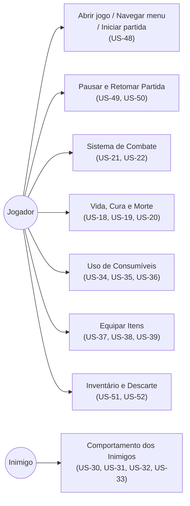
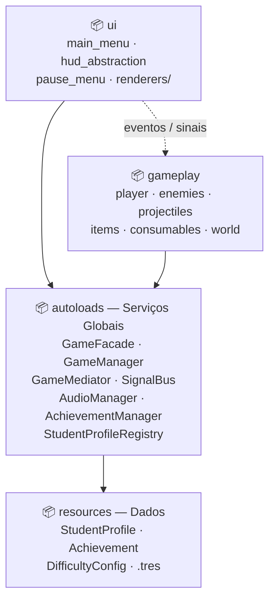
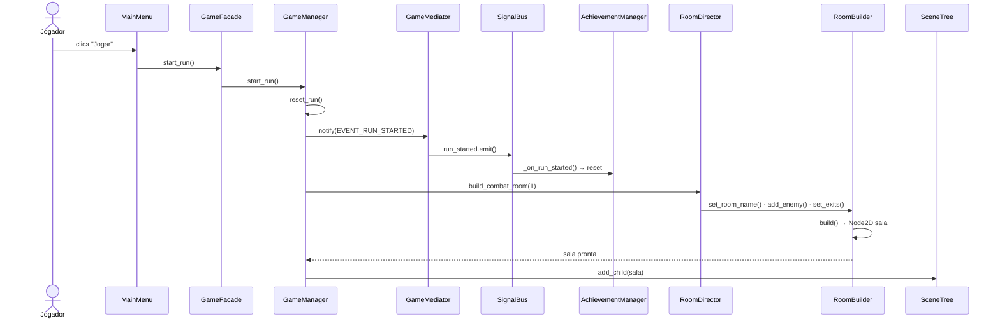
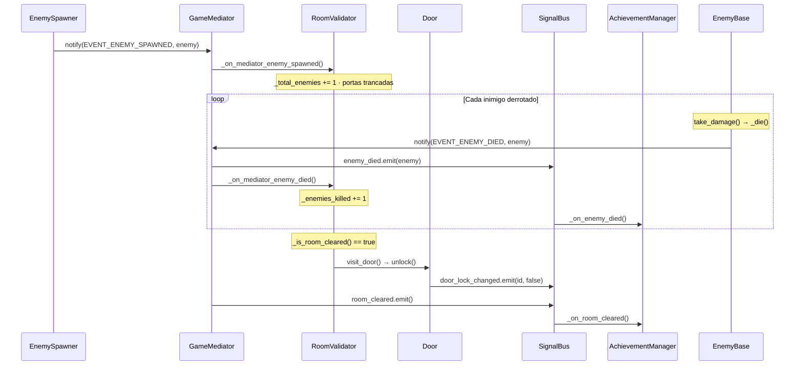
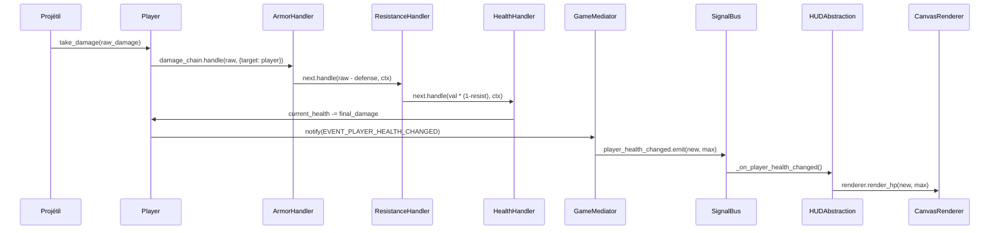
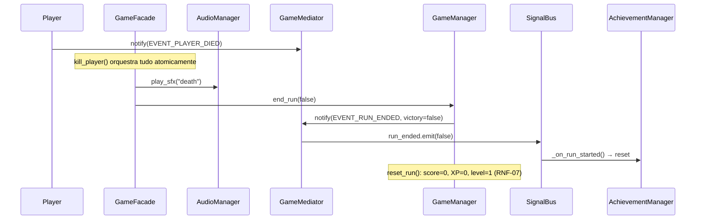
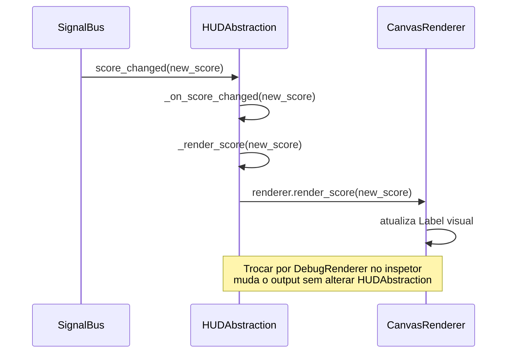

# MadDev — Documento de Arquitetura de Software

## Sumário

1. [Introdução](#1-introdução)
   - 1.1 [Finalidade](#11-finalidade)
   - 1.2 [Escopo](#12-escopo)
   - 1.3 [Definições, Acrônimos e Abreviações](#13-definições-acrônimos-e-abreviações)
   - 1.4 [Referências](#14-referências)
   - 1.5 [Visão Geral do Documento](#15-visão-geral-do-documento)
2. [Representação Arquitetural](#2-representação-arquitetural)
3. [Metas e Restrições da Arquitetura](#3-metas-e-restrições-da-arquitetura)
4. [Visão de Casos de Uso](#4-visão-de-casos-de-uso)
   - 4.1 [Realizações de Casos de Uso](#41-realizações-de-casos-de-uso)
5. [Visão Lógica](#5-visão-lógica)
   - 5.1 [Visão Geral](#51-visão-geral)
   - 5.2 [Pacotes de Design Arquiteturalmente Significativos](#52-pacotes-de-design-arquiteturalmente-significativos)
6. [Visão de Processos](#6-visão-de-processos)
7. [Visão de Implantação](#7-visão-de-implantação)
8. [Visão de Implementação](#8-visão-de-implementação)
   - 8.1 [Visão Geral](#81-visão-geral)
   - 8.2 [Camadas](#82-camadas)
9. [Visão de Dados](#9-visão-de-dados)
10. [Tamanho e Desempenho](#10-tamanho-e-desempenho)
11. [Qualidade](#11-qualidade)

---

## 1. Introdução

### 1.1 Finalidade

Este documento fornece uma visão arquitetural abrangente do sistema "Jogo de Arquitetura", do Grupo 01 - **MadDev**, utilizando diferentes perspectivas para descrever aspectos distintos do jogo. Seu objetivo é capturar e comunicar as decisões arquiteturais significativas tomadas ao longo do desenvolvimento, servindo como referência para a equipe e para avaliação na disciplina de Arquitetura e Desenho de Software (UnB, 2026.1 — Turma 02, Grupo 1).

### 1.2 Escopo

Este documento descreve a arquitetura de software do projeto feito pelo Grupo 01 - **MadDev**, um jogo 2D *roguelike dungeon crawler* de perspectiva top-down desenvolvido em **Godot 4.6 / GDScript**. O projeto foi inspirado no jogo [Tiny Rogues](https://store.steampowered.com/app/2088570/Tiny_Rogues/). O escopo arquitetural cobre:

- A estrutura em camadas do sistema (UI, Gameplay, Serviços, Dados)
- O barramento de eventos como espinha dorsal de comunicação desacoplada
- Os padrões de projeto GoF implementados e suas realizações no código
- O fluxo de processos em tempo de execução (loop de jogo, combate, morte, progressão)
- A estrutura de implantação como aplicação desktop

### 1.3 Definições, Acrônimos e Abreviações

| Termo | Definição |
|-------|-----------|
| DAS | Documento de Arquitetura de Software |
| GoF | *Gang of Four* — os 23 padrões de projeto clássicos (Gamma et al., 1994) |
| GDScript | Linguagem de script nativa do Godot Engine, com tipagem opcional |
| Autoload | Nó Godot registrado globalmente no `project.godot`, equivalente ao padrão Singleton no motor |
| Run | Uma tentativa completa do jogador, do menu até morte ou vitória |
| Permadeath | Mecânica de morte permanente: todo o estado da run é apagado ao morrer |
| HUD | *Heads-Up Display* — camada de UI sobreposta ao gameplay em tempo real |
| CoR | *Chain of Responsibility* — padrão de cadeia de responsabilidade |
| RF | Requisito Funcional |
| RNF | Requisito Não Funcional |
| US | *User Story* — História de Usuário |
| `.tres` | Formato de Resource serializado do Godot (dados de configuração e assets) |

### 1.4 Referências

- **Backlog de Requisitos** — `docs/Documentacao/Backlog.md` (v1.2, jun/2026)
- **Roadmap de Desenvolvimento** — `docs/Documentacao/Roadmap.md` (v1.1, jun/2026)
- **Gamma, E. et al.** *Design Patterns: Elements of Reusable Object-Oriented Software*. Addison-Wesley, 1994.
- **Documentação oficial Godot 4.6** — https://docs.godotengine.org
- **Material de Aula** — Arquitetura e DAS (Partes I e II), Profa. Milene Serrano, UnB 2026.1

### 1.5 Visão Geral do Documento

O documento está organizado em 11 seções:

- **Seção 2** descreve os estilos arquiteturais adotados e as visões utilizadas.
- **Seção 3** apresenta as metas e restrições que guiaram as decisões arquiteturais.
- **Seção 4** lista os casos de uso arquiteturalmente significativos e suas realizações.
- **Seção 5 (Visão Lógica)** detalha a decomposição em pacotes, as classes arquiteturalmente relevantes e os padrões GoF implementados — *visão principal*.
- **Seção 6 (Visão de Processos)** descreve os fluxos dinâmicos em tempo de execução via diagramas de sequência — *segunda visão*.
- **Seção 7** descreve a configuração de implantação física.
- **Seção 8** apresenta a visão de implementação com a estrutura de camadas e componentes.
- **Seções 9–11** cobrem dados persistentes, dimensionamento e atributos de qualidade.

---

## 2. Representação Arquitetural

O projeto combina dois estilos arquiteturais principais:

**Arquitetura em Camadas (Layered Architecture)**
O sistema é organizado em quatro camadas com dependência unidirecional descendente:

| Camada | Responsabilidade | Principais componentes |
|--------|-----------------|----------------------|
| UI | Apresentação e interação com o jogador | `main_menu`, `hud_abstraction`, `pause_menu` |
| Gameplay | Lógica de jogo, entidades e mundo | `player`, `enemies`, `projectiles`, `items`, `world` |
| Serviços (Autoloads) | Coordenação global e serviços compartilhados | `GameFacade`, `GameManager`, `GameMediator`, `SignalBus`, `AudioManager`, `AchievementManager`, `StudentProfileRegistry` |
| Dados | Recursos estáticos e configurações | `StudentProfile`, `Achievement`, `DifficultyConfig`, arquivos `.tres` |

**Arquitetura Orientada a Eventos (Event-Driven)**
A comunicação entre sistemas é desacoplada por um barramento de eventos duplo:
- `GameMediator`: coordenador formal de eventos tipados — sistemas publicam via `notify()` e se inscrevem via `register()`
- `SignalBus`: bridge de sinais nativos Godot — permite conexões via inspetor e compatibilidade com o motor

As visões documentadas neste DAS são **Casos de Uso**, **Lógica** e **Processos** (foco principal da entrega), com **Implantação** e **Implementação** cobertas em nível de visão geral.

---

## 3. Metas e Restrições da Arquitetura

| Categoria | Meta / Restrição |
|-----------|-----------------|
| **Plataforma alvo** | PC Desktop (Windows/Linux); motor Godot 4.6 |
| **Linguagem** | GDScript com tipagem estática onde aplicável |
| **Renderização** | GL Compatibility Renderer (suporte a hardware legado) |
| **Resolução** | 320×180 px lógico, escalado para 1280×720 px físico via `canvas_items` |
| **Permadeath** | RNF-07: ao morrer, todo o estado da sessão (itens, stats, XP, nível) deve ser completamente resetado, sem qualquer persistência entre runs |
| **Desacoplamento** | Nenhum nó de domínios diferentes deve se comunicar diretamente; toda comunicação passa por `GameMediator` ou `SignalBus` |
| **Extensibilidade** | Novos tipos de inimigo, sala e item devem ser adicionáveis sem alterar código existente (princípio aberto/fechado, via Factory Method, Builder e Decorator) |
| **Testabilidade** | Cada padrão arquitetural possui cena de teste standalone (`test_builder.gd`, `test_facade.gd`, `test_pool.gd`, `test_patterns.gd`) executável isoladamente no editor Godot |
| **Performance** | Object Pool para projéteis evita alocação dinâmica e pressão no GC durante combate |
| **Gravidade** | `2d/default_gravity=0` — jogo top-down sem simulação gravitacional |
| **Metodologia** | Cascata Incremental + ciclo de produção de Chandler (Pré-Produção → Modelagem → Produção → Testes → Finalização), com uso de artefatos e estratégias do Scrum. A fase de Modelagem precede cada incremento de implementação, o que motivou o registro arquitetural formal neste documento |

---

## 4. Visão de Casos de Uso

Os diagramas de casos de uso abaixo foram elaborados pelo time na Entrega 02 da disciplina e cobrem as interações mais relevantes do jogador com o sistema. Cada diagrama foi atribuído a um membro da equipe e está vinculado às *User Stories* correspondentes do Backlog.



| Diagrama | US Relacionadas | Responsável | Elementos Arquiteturais Exercitados |
|----------|-----------------|-------------|--------------------------------------|
| Abrir jogo / Navegar menu / Iniciar partida | US-48 | Breno Lucena | Facade (`start_run`), Builder+Director, Singleton |
| Pausar e Retomar Partida | US-49, US-50 | Felipe Veríssimo | Singleton (`toggle_pause`), Observer (`SignalBus`) |
| Sistema de Combate | US-21, US-22 | Kauã Richard | Factory Method, Object Pool, CoR (dano) |
| Vida, Cura e Morte do Personagem | US-18, US-19, US-20 | Lucas Freire | CoR (`ArmorHandler` → `ResistanceHandler` → `HealthHandler`), Bridge (HUD), Facade (`kill_player`) |
| Comportamento dos Inimigos em Combate | US-30, US-31, US-32, US-33 | Mateus Vieira | Factory Method, Strategy (IA melee/ranged), Mediator |
| Uso de Consumíveis | US-34, US-35, US-36 | Philipe Morais | Template Method (`ConsumableBase`), Observer |
| Equipar Itens | US-37, US-38, US-39 | Pietro Visentin | Decorator (atributos empilháveis), Iterator |
| Inventário e Descarte de Itens | US-51, US-52 | Vinícius Rufino | Iterator, Decorator, Observer |

### 4.1 Realizações de Casos de Uso

**Iniciar partida (US-48)**

O jogador abre o jogo, navega no menu principal e clica em "Iniciar Partida". `MainMenu` chama `GameFacade.start_run()`, que delega para `GameManager.start_run()`. O GameManager executa `reset_run()` — limpando qualquer estado residual de runs anteriores — e notifica `GameMediator` com `EVENT_RUN_STARTED`. O Mediator emite `SignalBus.run_started`, que aciona o `AchievementManager` para reiniciar o rastreamento de conquistas. Em seguida, o `RoomDirector` usa o `RoomBuilder` para construir a primeira sala passo a passo.

**Sistema de Combate — Vida, Cura e Morte (US-18 a US-22)**

Quando um projétil acerta o jogador, `take_damage()` percorre a cadeia de responsabilidade (`ArmorHandler` → `ResistanceHandler` → `HealthHandler`), que calcula o dano final após aplicar armadura e resistência. O `HealthHandler` atualiza `current_health` e notifica `GameMediator` com `EVENT_PLAYER_HEALTH_CHANGED`; o `HUDAbstraction` repassa ao `CanvasRenderer` via Bridge para atualizar a barra de vida. Se `current_health == 0`, dispara o fluxo de morte descrito abaixo.

**Comportamento dos Inimigos em Combate (US-30 a US-33)**

Ao detectar o jogador, o inimigo assume comportamento hostil e entra em ciclo tático: persegue o alvo via Strategy (`EnemyMelee` avança em linha reta; `EnemyRanged` mantém distância) e ataca via seus respectivos métodos de ataque. Cada tipo concreto de inimigo é instanciado pelo Factory Method em `EnemySpawner`. Quando um inimigo morre, `GameMediator` notifica `RoomValidator` (`EVENT_ENEMY_DIED`) para contagem; ao zerar todos os inimigos, o Visitor (`visit_door()`) destranca as portas.

**Morte do Personagem e Permadeath (US-20, RNF-07)**

Quando `Player.current_health == 0`, `_die()` notifica `GameMediator` com `EVENT_PLAYER_DIED`. `GameFacade.kill_player()` orquestra a sequência atomicamente: toca o som de morte via `AudioManager` e chama `GameManager.end_run(false)`. O GameManager muda o estado para `GAME_OVER` e emite `EVENT_RUN_ENDED` via `SignalBus`, que avisa o `AchievementManager`. Por fim, `reset_run()` zera score, XP e nível — cumprindo RNF-07 (permadeath total).

---

## 5. Visão Lógica

### 5.1 Visão Geral

A Visão Lógica descreve como o sistema é organizado conceitualmente — ou seja, como as responsabilidades foram divididas entre grupos de componentes, independentemente de como os arquivos estão dispostos em disco. O objetivo é tornar evidente quem faz o quê e como as partes se relacionam.

O projeto é organizado em quatro camadas. Cada camada tem uma responsabilidade clara e só pode depender das camadas abaixo dela — nunca das acima. Isso evita que, por exemplo, uma regra de jogo fique misturada com a lógica de exibição de botões.

- **UI** — é tudo o que o jogador vê e com o que interage diretamente: o menu principal, o HUD com as informações da partida e o menu de pausa. Essa camada não decide o que acontece no jogo; ela apenas exibe informações e repassa ações do jogador para as camadas abaixo.

- **Gameplay** — é onde o jogo de fato acontece: o personagem jogável, os inimigos, os projéteis, os itens e a estrutura das salas. Essa camada contém as regras e comportamentos do jogo.

- **Serviços (Autoloads)** — são os coordenadores globais do sistema. Funcionam como "gerentes" acessíveis por qualquer parte do jogo: um controla o estado da partida, outro gerencia o áudio, outro serve como canal de comunicação entre sistemas que não devem se conhecer diretamente. Por serem globais, qualquer camada pode utilizá-los.

- **Dados** — são as configurações e perfis que definem o comportamento do jogo sem conter lógica. Exemplos: os atributos base de cada tipo de personagem e as definições de conquistas. São arquivos lidos no início da execução e nunca alterados durante a partida.

O diagrama abaixo ilustra essa organização e as direções de dependência entre as camadas:



### 5.2 Pacotes de Design Arquiteturalmente Significativos

---

#### Pacote `autoloads` — Serviços Globais

Um **Autoload** no Godot é um nó registrado globalmente no arquivo de configuração do projeto (`project.godot`), carregado automaticamente ao iniciar o jogo e acessível por nome em qualquer script, sem necessidade de referência direta. É o mecanismo nativo do motor para implementar serviços compartilhados — equivalente ao padrão Singleton em outras linguagens. Todos os componentes deste pacote funcionam dessa forma.

```mermaid
classDiagram
        +start_run()
        +end_run(victory: bool)
        +kill_player()
        +victory()
        +toggle_pause()
        +award_points(amount: int)
        +award_points_with_sound(amount: int)
        +play_sound(name: String)
        +play_music(name: String)
        +stop_music()
        +emit_player_died()
        +emit_enemy_died(enemy: Node)
        +emit_room_cleared()
    }

        +current_state: GameState
        +current_room_index: int
        +run_score: int
        +player_level: int
        +player_xp: int
        +start_run()
        +end_run(victory: bool)
        +reset_run()
        +toggle_pause()
        +add_score(amount: int)
        +load_room(type: String, difficulty: int)
    }

        -_handlers: Dictionary
        +notify(sender, event, data)
        +register(event, callback)
        +unregister(event, callback)
    }

        player_health_changed(new_health, max_health)
        player_died()
        enemy_died(enemy)
        room_cleared()
        door_lock_changed(door_id, locked)
        item_picked_up(item_data)
        run_started()
        run_ended(victory)
        game_paused(is_paused)
        score_changed(new_score)
        achievement_unlocked(achievement)
    }

        +play_music(stream, fade_in)
        +stop_music()
        +play_sfx(stream)
        +play_sfx_by_name(name: String)
        +play_music_by_name(name: String)
    }

        -achievements: Array
        -_stats: Dictionary
        +get_all_achievements()
        +get_unlocked_achievements()
        +reset_achievements()
    }

        -_cache: Dictionary
        +get_profile(name: String) StudentProfile
        +get_all_profiles() Array
    }

    %% GameFacade é o ponto central que aciona os três serviços abaixo
    GameFacade --> GameManager
    GameFacade --> AudioManager
    GameFacade --> GameMediator
    %% GameMediator repassa os eventos para os sinais nativos do Godot via SignalBus
    GameMediator --> SignalBus : bridge
    %% AchievementManager escuta os sinais do SignalBus para avaliar conquistas
    AchievementManager --> SignalBus : observa
    %% O Registry carrega cada perfil uma vez e o mantém em cache para reutilização
    StudentProfileRegistry --> StudentProfile : cacheia
```

| Componente | Responsabilidade | Padrão |
|------------|-----------------|--------|
| `GameFacade` | Ponto único de entrada para gameplay. Agrega `GameManager`, `AudioManager` e `GameMediator`. `kill_player()` é método composto: som + evento + encerramento de run atomicamente | Facade |
| `GameManager` | Mantém estado da run (`GameState`, room index, score, XP). Fonte única de reset via `reset_run()` | Singleton |
| `GameMediator` | Coordenador de eventos tipados. Mantém `Dictionary` de `Callable` por evento; faz a bridge para `SignalBus` | Mediator |
| `SignalBus` | Define os sinais nativos Godot como API de eventos. Permite conexões via inspetor e compatibilidade com o motor | Observer / Mediator |
| `AudioManager` | Interface global de áudio; carrega streams dinamicamente por nome de arquivo | Singleton |
| `AchievementManager` | Observa eventos do `SignalBus` e avalia condições de conquista armazenadas em `Callable` | Observer |
| `StudentProfileRegistry` | Carrega e cacheia perfis de personagem (`.tres`), garantindo instância única por chave | Multiton |

---

#### Pacote `world` — Geração e Estrutura de Salas

Este pacote é responsável por tudo que compõe o espaço físico do jogo: a construção das salas, o controle das portas e o gerenciamento dos projéteis em voo. A geração de salas é feita sob demanda — cada sala é montada peça por peça no momento em que o jogador avança, sem estar pré-carregada na memória.

```mermaid
classDiagram
        +set_room_name(name) RoomBuilderBase
        +add_enemy(type, pos) RoomBuilderBase
        +add_enemies(list) RoomBuilderBase
        +set_enemy_count(count, type) RoomBuilderBase
        +add_item(type, pos) RoomBuilderBase
        +set_exits(directions) RoomBuilderBase
        +set_player_start(pos) RoomBuilderBase
        +set_tilemap(path) RoomBuilderBase
        +build() Node2D
    }

        -_room_name: String
        -_enemy_list: Array
        -_item_list: Array
        -_door_positions: Array
        -_player_start_position: Vector2
        +build() Node2D
    }

        -_builder: RoomBuilderBase
        +set_builder(builder)
        +build_combat_room(difficulty: int) Node2D
        +build_rest_room() Node2D
        +build_boss_room() Node2D
        +build_empty_room() Node2D
    }

        +managed_door_ids: Array
        -_total_enemies: int
        -_enemies_killed: int
        +visit_enemy(enemy: Node)
        +visit_door(door: Node)
    }

        +door_id: String
        +starts_locked: bool
        +is_locked: bool
        +lock()
        +unlock()
        +toggle()
        +accept(visitor: Object)
    }

        +pool_size: int
        +auto_expand: bool
        +get_projectile(pos, dir) Area2D
        +return_projectile(projectile)
        +get_pool_status() Dictionary
    }

    %% RoomBuilder implementa o contrato de construção definido por RoomBuilderBase
    RoomBuilderBase <|-- RoomBuilder
    %% O Director conhece e utiliza o Builder para montar salas segundo suas receitas
    RoomDirector --> RoomBuilderBase : usa
    %% O Validator visita a porta para destrancá-la quando a sala for limpa
    RoomValidator --> Door : visit_door()
    %% A porta aceita o Validator como visitante para ser inspecionada
    Door --> RoomValidator : accept(visitor)
```

| Componente | Responsabilidade | Padrão |
|------------|-----------------|--------|
| `RoomBuilderBase` / `RoomBuilder` | Constrói uma sala `Node2D` passo a passo com API fluente encadeável | Builder |
| `RoomDirector` | Encapsula receitas de sala (`build_combat_room(difficulty)`, `build_rest_room()`, `build_boss_room()`, `build_empty_room()`). Substituir o Builder muda a representação sem alterar as receitas | Director |
| `RoomValidator` | Visitante que conta inimigos spawned e, ao detectar sala limpa, visita cada porta para destrancá-la | Visitor |
| `Door` | Aceita visitantes via `accept(visitor)` e notifica mudança de estado via `SignalBus.door_lock_changed` | Visitor client |
| `ProjectilePool` | Pré-aloca N projéteis reutilizáveis. `get_projectile()` ativa instância inativa; `return_projectile()` a desativa de volta ao pool | Object Pool |

---

#### Pacote `enemies` — Factory Method e Strategy

Este pacote contém os inimigos do jogo e a lógica responsável por criá-los nas salas. Há uma separação clara entre *criar* o inimigo (responsabilidade dos Spawners) e *como ele se comporta* (responsabilidade das classes de inimigo). Isso permite adicionar novos tipos de inimigo sem mexer no código de geração existente.

```mermaid
classDiagram
        +spawn() CharacterBody2D
        #_create_enemy() CharacterBody2D
    }

        #_create_enemy() CharacterBody2D
    }

        #_create_enemy() CharacterBody2D
    }

        +max_health: int
        +resistance: int
        +attack_damage: int
        +move_speed: float
        +current_health: int
        +take_damage(amount: int)
        #_die()
        #_get_move_direction() Vector2
    }

        #_get_move_direction() Vector2
    }

        #_get_move_direction() Vector2
        +_fire_projectile()
    }

    %% BasicEnemySpawner e RangedEnemySpawner herdam a lógica de spawn de EnemySpawner
    EnemySpawner <|-- BasicEnemySpawner
    EnemySpawner <|-- RangedEnemySpawner
    %% EnemyMelee e EnemyRanged herdam atributos e comportamentos base de EnemyBase
    EnemyBase <|-- EnemyMelee
    EnemyBase <|-- EnemyRanged
```

| Componente | Responsabilidade | Padrão |
|------------|-----------------|--------|
| `EnemySpawner` | Creator abstrato: define `_create_enemy()` como hook de extensão e `spawn()` como template de spawn (posiciona, agrupa e notifica via Mediator) | Factory Method |
| `BasicEnemySpawner` / `RangedEnemySpawner` | ConcreteCreators: cada um instancia seu tipo de inimigo sem alterar a lógica de spawn do Creator | Factory Method |
| `EnemyBase` | `_physics_process()` chama `_get_move_direction()` que cada subclasse sobrescreve | Template Method |
| `EnemyMelee` | Persegue o jogador diretamente | Strategy |
| `EnemyRanged` | Mantém distância do jogador e atira projéteis | Strategy |

---

#### Pacote `damage` — Chain of Responsibility

Quando o jogador recebe dano, o valor bruto não é aplicado diretamente à vida — ele passa por uma sequência de "filtros" encadeados, cada um com uma função específica de modificação. Essa cadeia pode ser configurada livremente no inspetor do Godot, permitindo ajustar o cálculo de dano sem alterar o código.

```mermaid
classDiagram
        +next: DamageHandler
        +handle(damage: int, context: Dictionary) int
    }

        +handle(damage: int, context: Dictionary) int
    }

        +handle(damage: int, context: Dictionary) int
    }

        +handle(damage: int, context: Dictionary) int
    }

        +damage_chain: DamageHandler
        +take_damage(amount: int)
    }

    %% Cada handler é uma especialização de DamageHandler com sua própria regra de cálculo
    DamageHandler <|-- ArmorHandler
    DamageHandler <|-- ResistanceHandler
    DamageHandler <|-- HealthHandler
    %% Cada handler conhece o próximo da fila para passar o dano adiante
    DamageHandler --> DamageHandler : next
    %% O Player usa a cadeia para processar qualquer dano que receber
    Player --> DamageHandler : damage_chain
```

Cada handler processa o dano e passa para o próximo elo da cadeia:

- `ArmorHandler` — aplica redução flat: `max(0, damage - player.defense)`
- `ResistanceHandler` — aplica resistência percentual: `damage * (1 - player.resistance)`
- `HealthHandler` — aplica o dano final à vida do alvo

A cadeia é configurável como `Resource` no inspetor do Godot. *(Padrão: **Chain of Responsibility**)*

---

#### Pacote `items` — Decorator e Iterator

Os itens do jogo são construídos por camadas: um item base carrega os atributos fundamentais, e decoradores são "embrulhados" em volta dele para adicionar efeitos extras em runtime. Isso permite combinar propriedades livremente — por exemplo, um item raro que também causa queima — sem criar uma classe separada para cada combinação. Os iteradores deste pacote permitem percorrer listas de inimigos ou itens com critérios customizados.

```mermaid
classDiagram
        +item_name: String
        +base_value: int
        +get_effect() String
        +get_value() int
    }

        +wrapped: ItemBase
        +get_effect() String
        +get_value() int
    }

        +rarity_bonus: int
        +get_effect() String
        +get_value() int
    }

        +get_effect() String
        +get_value() int
    }

        +get_effect() String
        +get_value() int
    }

        +enemies: Array
        +origin: Vector2
        +_iter_init(arg) bool
        +_iter_next(arg) bool
        +_iter_get(arg) Variant
    }

        +_iter_init(arg) bool
        +_iter_next(arg) bool
        +_iter_get(arg) Variant
    }

    %% ItemDecorator herda a interface de ItemBase para poder ser usado no lugar dele
    ItemBase <|-- ItemDecorator
    %% Cada decorador concreto herda de ItemDecorator e adiciona seu efeito específico
    ItemDecorator <|-- RareDecorator
    ItemDecorator <|-- BurnDecorator
    ItemDecorator <|-- DoubleDropDecorator
    %% O decorador envolve um ItemBase internamente para empilhar efeitos em camadas
    ItemDecorator --> ItemBase : wraps
```

| Componente | Responsabilidade | Padrão |
|------------|-----------------|--------|
| `ItemBase` → `ItemDecorator` | Decoradores são empilháveis em runtime: `RareDecorator(BurnDecorator(item))` concatena efeitos sem herança múltipla. `RareDecorator` prefixa o efeito e soma `rarity_bonus` ao valor | Decorator |
| `SortedEnemyIterator` | Implementa o protocolo nativo GDScript (`_iter_init`/`_iter_next`/`_iter_get`), permitindo `for enemy in SortedEnemyIterator(enemies, origin)`. Ordena inimigos por distância ao ponto de referência | Iterator |
| `FilteredItemIterator` | Itera itens aplicando critério de filtro | Iterator |

---

#### Pacote `ui` — Bridge no HUD

O HUD (interface sobreposta ao jogo) é dividido em duas responsabilidades independentes: *o que* exibir e *como* exibir. A abstração decide quais informações mostrar; o renderer decide a forma visual. Isso permite, por exemplo, trocar a exibição real por uma versão de debug sem alterar nenhuma lógica de jogo.

```mermaid
classDiagram
        +renderer: UIRenderer
        +update_consumables(list)
        #_render_hp(value, max)
        #_render_score(value)
    }

        +bind(nodes: Dictionary)
        +render_hp(value, max)
        +render_score(value)
        +render_time(elapsed)
    }

        +render_hp(value, max)
        +render_score(value)
        +render_time(elapsed)
    }

        +render_hp(value, max)
        +render_score(value)
        +render_time(elapsed)
    }

    %% HUDAbstraction delega toda renderização visual para o renderer configurado no inspetor
    HUDAbstraction --> UIRenderer : delega
    %% CanvasRenderer e DebugRenderer implementam o contrato de renderização de formas distintas
    UIRenderer <|-- CanvasRenderer
    UIRenderer <|-- DebugRenderer
```

`HUDAbstraction` define *o que* exibir (`render_hp`, `render_score`, `render_time`); o `UIRenderer` concreto define *como* renderizar. Trocar `CanvasRenderer` por `DebugRenderer` no inspetor muda a saída sem alterar a abstração. *(Padrão: **Bridge**)*

---

#### Pacote `player`

Este pacote concentra toda a lógica do personagem controlado pelo jogador: movimento, esquiva, vida, dano recebido e slots de equipamento. A leitura dos controles é separada da execução das ações, tornando mais fácil trocar o esquema de controle no futuro sem reescrever a lógica do personagem.

```mermaid
classDiagram
        +move_speed: float
        +dash_speed: float
        +dash_duration: float
        +dash_cooldown: float
        +max_health: int
        +base_damage: int
        +defense: int
        +resistance: float
        +current_health: int
        +damage_chain: DamageHandler
        +equipment: Dictionary
        +take_damage(amount: int)
        +heal(amount: int)
        +equip(slot: EquipSlot, item: Resource)
        +unequip(slot: EquipSlot)
        #_read_move_input() Vector2
        #_read_dash_input() bool
        #_execute_dash()
        #_die()
    }
```

`_read_move_input()` e `_read_dash_input()` isolam a leitura de input *(Adapter)*; `_execute_dash()` encapsula a execução do dash separada da leitura *(Command)*. `take_damage()` delega para a cadeia CoR. Cinco slots de equipamento (`HEAD`, `TORSO`, `LEG`, `FOOT`, `ACCESSORY`).

---

#### Pacote `resources` — Dados e Multiton

Este pacote contém os dados estáticos que definem o comportamento do jogo: os perfis de personagem (com seus atributos base) e as definições de conquistas. Não há lógica de jogo aqui — apenas configurações lidas no início da execução e aplicadas onde necessário.

```mermaid
classDiagram
        +profile_name: String
        +base_hp_modifier: float
        +base_speed_modifier: float
        +base_damage_modifier: float
        +starting_weapon: String
        +apply_to(player: Node)
    }

        -_cache: Dictionary
        +get_profile(name: String) StudentProfile
        +get_all_profiles() Array
    }

        +id: StringName
        +name: String
        +description: String
        +unlocked: bool
        +event: StringName
        +condition: Callable
        +setup(...) Achievement
        +can_unlock(data: Dictionary) bool
    }

    %% O Registry garante que cada perfil exista apenas uma vez na memória do jogo
    StudentProfileRegistry --> StudentProfile : cacheia instância única
```

`StudentProfileRegistry` carrega cada `.tres` de perfil uma única vez e o cacheia, garantindo que não existam duplicatas em memória. Os quatro perfis disponíveis (`Calouro`, `Veterano`, `Jubilado`, `Cara da Atlética`) possuem modificadores base distintos aplicados ao jogador no início da run via `apply_to(player)`. *(Padrão: **Multiton**)*

---

## 6. Visão de Processos


### 6.1 Inicialização de Run

Mostra o que acontece desde o momento em que o jogador clica em "Jogar" até a primeira sala aparecer na tela: o `GameFacade` recebe o comando, o `GameManager` limpa o estado anterior, e o `RoomDirector` + `RoomBuilder` constroem e carregam a sala.



### 6.2 Loop de Combate e Liberação de Sala

Ilustra como o jogo controla o combate dentro de uma sala: ao entrar, as portas trancam automaticamente; cada inimigo derrotado é contado pelo `RoomValidator`; quando todos caem, as portas destrancam e conquistas são verificadas.



### 6.3 Cadeia de Dano ao Jogador

Detalha o caminho que um dano percorre antes de subtrair a vida do jogador: o valor bruto passa por `ArmorHandler` (reduz pela armadura), depois por `ResistanceHandler` (aplica resistência) e só então chega ao `HealthHandler`, que atualiza a vida e notifica o HUD.



### 6.4 Morte do Jogador e Permadeath

Representa o que ocorre quando o jogador morre: o `GameFacade` orquestra o encerramento da run de forma atômica — toca o som de morte, encerra a partida e apaga completamente o progresso (score, XP, nível), conforme exige o requisito de permadeath (RNF-07).



### 6.5 Padrão Bridge no HUD

Exemplifica o padrão Bridge em ação: quando a pontuação muda, o `SignalBus` notifica o `HUDAbstraction`, que delega a renderização ao `CanvasRenderer` — substituir esse renderer por qualquer outro (ex.: `DebugRenderer`) altera como o HUD é exibido sem precisar tocar na lógica do jogo.



---

## 7. Visão de Implantação

O projeto é distribuído como **executável desktop** gerado pelo Godot 4.6 Export. Não há servidores externos, banco de dados remoto ou dependências de rede.

```mermaid
graph TD
    %% Diagrama de implantação: mostra onde o jogo roda e o que está dentro do executável

    subgraph Máquina do Jogador
        %% O executável é o arquivo que o jogador abre para iniciar o jogo
        EXE["MadDev.exe / MadDev.x86_64"]

        subgraph Motor
            %% O Godot Engine é o programa responsável por rodar o jogo (renderização, física, etc.)
            GE["Godot 4.6 Engine\n(GL Compatibility)"]
            %% A GDScript VM interpreta e executa todo o código do jogo em tempo real
            VM["GDScript VM\n(main thread)"]
        end

        subgraph Recursos Embutidos
            %% Tudo abaixo está empacotado dentro do executável — não há download externo
            SCENES["scenes/"]
            SCRIPTS["scripts/"]
            RESOURCES["resources/"]
            ART["art/"]
        end

        %% O executável inicializa o Motor, que por sua vez carrega os Recursos Embutidos
        EXE --> Motor
        Motor --> Recursos Embutidos
    end
```

**Nó físico único:** toda a execução ocorre na máquina do jogador. Todos os recursos do jogo (cenas, scripts, arte, áudio) são empacotados no executável ou em arquivo `.pck` adjacente via Godot Export. Requisito mínimo de hardware: CPU x86_64, GPU com suporte a OpenGL ES 3.0.

---

## 8. Visão de Implementação

### 8.1 Visão Geral

A implementação segue a estrutura de diretórios nativa do projeto Godot, com separação clara entre lógica (`scripts/`), composição visual (`scenes/`), dados (`resources/`) e assets (`art/`):

```
jogo/
├── project.godot              ← configuração do motor (autoloads, input map, display)
├── scripts/
│   ├── autoloads/             ← serviços globais (Singletons registrados como Autoloads)
│   ├── player/                ← entidade jogador
│   ├── enemies/               ← inimigos e spawners (Factory Method)
│   ├── projectiles/           ← projéteis (Object Pool client)
│   ├── damage/                ← cadeia de responsabilidade de dano
│   ├── items/decorators/      ← decoradores de item
│   ├── consumables/           ← consumíveis (Template Method)
│   ├── iterators/             ← iteradores customizados (protocolo GDScript)
│   ├── ui/                    ← HUD (Bridge), menus e renderers
│   └── resources/             ← tipos de dados (perfis, conquistas, dificuldade)
├── scenes/                    ← cenas Godot (.tscn) compostas por nós e scripts
│   ├── ui/                    ← main_menu.tscn, hud.tscn, pause_menu.tscn
│   ├── player/                ← player.tscn
│   ├── enemies/               ← enemy.tscn, enemy_ranged.tscn
│   ├── world/                 ← door.tscn, test_room.tscn
│   └── projectiles/           ← projectile.tscn
├── resources/
│   └── profiles/              ← calouro.tres, veterano.tres, jubilado.tres, atletica.tres
└── art/
    ├── tilesets/              ← tileset da sala
    └── themes/                ← tema visual dos menus
```

### 8.2 Camadas

**Camada de UI** — `scripts/ui/`, `scenes/ui/`

Contém `main_menu.gd`, `hud_abstraction.gd`, `pause_menu.gd` e os renderers do padrão Bridge. Regra: esta camada se comunica com os Autoloads exclusivamente via `GameFacade` e reage a eventos do `SignalBus`. Não referencia scripts de gameplay diretamente.

**Camada de Gameplay** — `scripts/player/`, `scripts/enemies/`, `scripts/projectiles/`, `scripts/items/`, `scripts/consumables/`, `scripts/world/`

Contém a lógica das entidades do jogo. Regra: comunicação entre entidades de domínios diferentes é feita via `GameMediator.notify()`, nunca por referência direta entre scripts.

**Camada de Serviços** — `scripts/autoloads/`

Autoloads globais. Regra: são a única camada que pode ser referenciada por qualquer outra. Nunca referenciam cenas ou nós específicos das camadas superiores por nome.

**Camada de Dados** — `scripts/resources/`, `resources/`

Resources Godot estáticos e arquivos `.tres` de configuração. Regra: sem lógica de jogo — apenas dados, modificadores e metadados.

---

## 9. Visão de Dados

O jogo não possui persistência entre sessões de jogo (RNF-07). Não há banco de dados, arquivos de save nem comunicação com servidores externos.

Os únicos dados persistentes em disco são os **Resources `.tres`** empacotados com o executável:

| Resource | Conteúdo | Utilizado por |
|----------|----------|---------------|
| `profiles/calouro.tres` | HP ×1.0, velocidade ×1.1, dano ×0.9 — perfil equilibrado, porém com dano levemente reduzido | `StudentProfileRegistry` |
| `profiles/veterano.tres` | HP ×1.2, velocidade ×1.0, dano ×1.2 — mais resistente e mais forte que o Calouro | `StudentProfileRegistry` |
| `profiles/jubilado.tres` | HP ×1.5, velocidade ×0.85, dano ×1.0 — tanque com muita vida, porém mais lento | `StudentProfileRegistry` |
| `profiles/atletica.tres` | HP ×1.1, velocidade ×1.25, dano ×1.1 — perfil ágil com bônus em todos os atributos | `StudentProfileRegistry` |
| `art/tilesets/room.tres` | Tileset da sala (floor + wall) | `RoomBuilder` |
| `art/themes/main_theme.tres` | Tema visual dos menus | Cenas de UI |

Todo o estado volátil da run (vida atual, XP, nível, inventário, score) existe apenas em memória nas variáveis dos nós e é descartado ao encerrar a run via `GameManager.reset_run()`.

---

## 10. Tamanho e Desempenho

| Métrica | Valor |
|---------|-------|
| Resolução lógica | 320×180 px |
| Resolução física | 1280×720 px (escalado via `canvas_items`) |
| Gravidade 2D | 0 (top-down, sem simulação gravitacional) |
| Pool de projéteis | 10 instâncias pré-alocadas (expansão automática) |
| Salas por run | 12 (RF-12: sala 1 vazia, salas 2–10 variadas, sala 11 pré-boss, sala 12 boss) |
| Perfis de personagem | 4 (Calouro, Veterano, Jubilado, Cara da Atlética) |
| Tipos de inimigo implementados | 2 (melee, ranged); Boss previsto |
| Scripts GDScript | ~35 arquivos |
| Cenas principais (.tscn) | ~10 |
| Camadas de física | 5 (player, walls, enemies, projectiles, items) |

**Estratégias de desempenho:**

- `ProjectilePool` elimina instanciação dinâmica durante combate, reduzindo pressão no GC do GDScript
- Inimigos usam `CharacterBody2D` com `move_and_slide()` processado nativamente pelo servidor de física do Godot
- `GameMediator` filtra `Callable` inválidos antes de executar, evitando chamadas a objetos destruídos
- Recursos de perfil são carregados uma única vez e cacheados no `StudentProfileRegistry` (Multiton), eliminando leituras de disco redundantes

---

## 11. Qualidade

| Atributo | Estratégia Arquitetural |
|----------|------------------------|
| **Manutenibilidade** | Separação clara por camadas e pacotes; cada módulo tem uma única razão para mudar. Padrões GoF explicitados nos cabeçalhos dos scripts facilitam a compreensão por novos membros da equipe |
| **Extensibilidade** | Factory Method permite adicionar tipos de inimigo sem alterar `EnemySpawner`. Builder aceita novos `ConcreteBuilder`. Decorator é empilhável para itens. Strategy é intercambiável para IA de inimigos e renderização do HUD |
| **Desacoplamento** | `GameMediator` + `SignalBus` garantem que `AchievementManager` não conhece `Player`, `RoomValidator` não conhece `EnemyMelee`, etc. Sistemas trocam apenas eventos tipados |
| **Testabilidade** | Cenas de teste standalone (`test_builder.gd`, `test_facade.gd`, `test_pool.gd`, `test_patterns.gd`) executáveis isoladamente com F6 no editor Godot. Assertions em scripts `@tool` verificam invariantes sem executar o jogo |
| **Confiabilidade (Permadeath)** | `GameManager.reset_run()` é a única fonte de reset. Sistemas ouvem `SignalBus.run_ended` para limpar estado próprio. Nenhum estado volátil persiste entre runs (RNF-07) |
| **Observabilidade** | `AchievementManager` expõe teclas de debug (K/I/R/P) em build de depuração para disparar eventos manualmente. `ProjectilePool.get_pool_status()` retorna contadores de instâncias ativas/disponíveis |
| **Portabilidade** | GL Compatibility Renderer permite execução em hardware sem suporte a Vulkan. Exportável para Windows e Linux pelo Godot Export |

---

## Histórico de Revisões

| Data | Versão | Descrição | Autor |
|------|--------|-----------|-------|
| 21/06/2026 | 1.0 | Criação do documento | [Vinícius Rufino](https://github.com/RufinoVfR), [Mateus Vieira](https://github.com/matix0), [Lucas Freire](https://github.com/AguionStryke), Breno Lucena Cordeiro, Philipe Barbosa de Morais, [Felipe Veríssimo](https://github.com/verissimoo), Pietro C. Visentin |
| 21/06/2026 | 1.1 | Revisão do documento baseando-se nas entregas passadas | [Vinícius Rufino](https://github.com/RufinoVfR) |