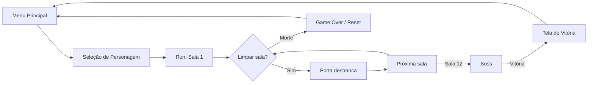

# Game Design Document (GDD) — MadDev

> Documento vivo de design do **MadDev**. Consolida o conceito, as mecânicas, a economia, a estrutura de progressão e a direção de arte do jogo. Mantém rastreabilidade com o [Backlog](/Documentacao/Backlog.md) (RF/RNF e Histórias de Usuário) e com o [Documento de Arquitetura de Software](/ArquiteturaReutilizacao/4.1.DAS.md).

## 1. Conceito

MadDev é um **roguelike dungeon crawler** top-down em que um estudante universitário percorre uma sequência de salas geradas a cada partida, combatendo inimigos, coletando itens e evoluindo até enfrentar um chefe final. Cada *run* é independente: ao morrer, todo o progresso é perdido (**permadeath**), incentivando rejogabilidade e domínio das mecânicas.

## 2. Tema e Narrativa

A ambientação é uma **paródia da vida acadêmica**. Os inimigos são objetos escolares antropomorfizados e "zumbificados" (livros, cadernos, provas), com expressão de "cara de mau". O chefe final é uma **metáfora visual de uma matéria de Arquitetura de Computadores saindo de controle** — uma criatura feita de placas de circuito, manuais de Assembly e um osciloscópio no lugar da cabeça. O tom é satírico, bem-humorado e exagerado.

## 3. Pilares de Design

| Pilar | Implicação de design |
|-------|----------------------|
| **Permadeath** | Estado da run resetado ao morrer (RNF-07). Sem persistência entre partidas. |
| **Progressão intra-run** | XP, level up e itens fortalecem o personagem dentro da mesma partida. |
| **Combate ágil** | Projéteis, dash com cooldown e variedade de armas/inimigos. |
| **Exploração com decisão** | Preview de recompensa nas portas; rotas opcionais com chave/bomba. |
| **Leitura visual clara** | Pixel art 16-bit, silhuetas reconhecíveis mesmo em 16x16. |

## 4. Loop de Jogo

Uma **run** percorre **12 salas** em sequência:

- **Sala 1** — inicial / vazia (sem combate).
- **Salas 2–10** — tipos variados: combate, baú, sala segura (cura total), loja.
- **Sala 11** — pré-boss.
- **Sala 12** — boss.

As saídas de uma sala de combate ficam **bloqueadas enquanto houver inimigos vivos** (US-57). Sempre há **pelo menos uma porta aberta** para evitar *softblock* (US-66). Cada porta exibe um **preview da recompensa** da próxima sala (US-67).

## 5. Personagem e Atributos

O jogador possui quatro atributos canônicos:

| Atributo | Função |
|----------|--------|
| **Vida** | Pontos de vida exibidos em corações; cada hit remove 1 ou meio coração. |
| **Dano** | Dano causado pelos ataques/projéteis. |
| **Velocidade** | Velocidade de movimentação. |
| **Cooldown de Dash** | Tempo de recarga da esquiva; reduzível por modificador de atributo. |

Atributos são alterados por **modificadores** vindos de itens, level up e perfil de personagem. *(RF-08, US-25, US-27)*

## 6. Tipos de Personagem

Quatro perfis jogáveis com atributos base distintos *(US-55)*:

| Personagem | Perfil temático | Característica de design |
|------------|-----------------|--------------------------|
| **Calouro** | Primeiro dia de aula, mochila nova, óculos limpos | Perfil equilibrado / iniciante |
| **Veterano** | Desleixado, cansado, roupas amassadas, olheiras | Perfil resistente |
| **Jubilado** | Chorando, mochila surrada, barbudo, mais velho | Perfil de risco/recompensa |
| **Mano da Atlética** | Atlético, roupa de time, sorriso brilhante | Perfil focado em força/velocidade |

## 7. Combate

- **Ataque e projéteis** — o ataque é unificado por instanciação de projéteis (US-06/US-21/US-22). Armas de **longo alcance** disparam projétil convencional; armas de **curto alcance** disparam um projétil que vai e volta (US-42).
- **Esquiva (Dash)** — deslocamento rápido com *cooldown* fixo, reduzível pelo atributo de Cooldown de Dash (US-53).
- **Colisões** — o personagem colide com cenário e objetos sólidos (US-24).
- **Dano por colisão** — inimigos causam dano ao tocar o jogador, além de seus ataques (US-30).

## 8. Progressão

- **Experiência (XP)** obtida ao coletar consumíveis de status (US-26/US-68).
- **Level up** — ao subir de nível, o jogo **congela** e apresenta a escolha entre **+Dano**, **+Vida Máxima** ou **+Velocidade** (US-54).
- **Modificadores** dinâmicos aplicados por itens e level up alteram os sistemas em runtime (US-27).

## 9. Inimigos

Inimigos possuem vida, resistência, ataque, mira, movimentação e padrões variados (RF-09). Tipos planejados:

| Inimigo | Descrição temática |
|---------|--------------------|
| **Livro** | Livro de capa dura com braços e pernas finos, expressão de raiva. |
| **Caderno** | Caderno espiral de capa colorida, expressão hostil. |
| **Provas** | Folha de prova enrugada com nota vermelha rabiscada. |
| **Gama** | Criatura ligada ao mascote/símbolo institucional "Gama". |

### Chefe Final (Boss)

Figura grande e caótica: **corpo de placas de circuito empilhadas**, fios soltos, manuais de Assembly anexados e um **osciloscópio no lugar da cabeça**; braços de cabo *flat ribbon*. Emite bipes em frequências erradas ao se mover. Comporta-se em **fases por faixa de HP** *(US-44)*:

| Fase | Faixa de HP | Comportamento |
|------|-------------|---------------|
| **Fase 1** | 100–50% | Dispara projéteis em **padrão binário** (rajadas curtas com pausas); movimento lento. |
| **Fase 2** | 50–20% | A cabeça-osciloscópio exibe **ondas senoidais**; padrão de ataque muda. |
| **Fase 3** | 20–0% | Trava por segundos exibindo **"kernel panic"** e solta uma **rajada caótica** em todas as direções. |

## 10. Itens

### Consumíveis *(RF-10)*

| Item | Efeito |
|------|--------|
| **Bomba** | Dano em área; explode baús e rochas. |
| **Chave** | Abre portas trancadas. |
| **Poção** | Restaura vida. |
| **Café** | Consumível de benefício/efeito temporário. |
| **Folha de Cola** | Consumível de benefício (estilo "cola de prova"). |
| **Gummy** | Bala de goma — consumível de benefício. |
| **Cigarro** | Consumível de benefício. |

- **Consumíveis de status** concedem **+1 em um atributo** (Dano, Vida ou Velocidade) **e +1 XP** (US-68).
- **Consumível de benefício** ocupa **slot único**, substituído ao coletar outro (US-56).

### Equipáveis *(RF-11)* — 5 slots

| Slot | Itens planejados |
|------|------------------|
| **Cabeça** | Boné · Chapéu mexicano (sombreiro) · Óculos comuns · Óculos Oakley Juliet |
| **Tronco** | Blusa de atlética · Jaleco de laboratório · Moletom com capuz · Corta-vento |
| **Perna** | Calça jeans · Bermuda comum · Bermuda cargo |
| **Pé** | Chinelo de dedo · Sapato social · Bota · Meia · Crocs com Jibbitz |
| **Acessório** | Anéis · Garrafa d'água · Botton · Atestado médico · Chaveiro imenso · Tirante de crachá · Medalha |

### Raridade *(RF-17, US-69)*

Quatro níveis sinalizados por cor: **Comum**, **Incomum**, **Raro**, **Épico**.

## 11. Economia e Loja *(RF-18)*

- **Moeda** obtida ao **explodir baús com bomba** (US-70). Explodir um baú também pode dar loot alternativo: moeda, bomba ou chave (US-72).
- **Sala de Loja** com NPCs vendedores por categoria (US-71): **Armeiro**, **Equipador**, **Boticário** e **Mentor**.

## 12. Interface (UI) *(RF-15, RF-16)*

- **Menu principal** (com opção Sair), **menu de pausa**, **menu de retomada** e **menu de fim de jogo** (vitória/derrota).
- **HUD** em tempo real: corações, arma equipada, bombas, poções, chaves e consumível de benefício.
- **Inventário** com possibilidade de **descarte** de itens.

## 13. Direção de Arte

Estética **pixel art retrô 16-bit** (referência SNES). Personagens em proporção *chibi* (cabeça grande, corpo pequeno), visão top-down em ângulo 3/4. Itens são representados como ícone/objeto isolado no mesmo ângulo.

### Especificações técnicas dos spritesheets

| Especificação | Valor |
|---------------|-------|
| Tamanho do frame | **16×16 px** (todas as entidades) |
| Formato | PNG-32 com canal alpha, fundo 100% transparente |
| Estilo | Pixels duros, **sem anti-aliasing**, sem gradiente suave |
| Paleta | Limitada e coesa (~32–48 cores no conjunto) |
| Luz | Incidência consistente de **cima-esquerda** |
| Contorno | *Outline* escuro de 1px em todas as silhuetas |
| Grade | Células coladas, **sem padding/margem** (slicing automático na Godot) |
| Ordem de linhas | **Baixo → Cima → Esquerda → Direita → (Ataque)** |
| Nomenclatura | `[categoria]_[entidade]_[animacao].png` |

### Catálogo de assets planejados

| Categoria | Itens | Layout |
|-----------|-------|--------|
| **Personagens** (4) | Calouro, Veterano, Jubilado, Mano da Atlética | 5 linhas × 4 frames (64×80px), com ataque |
| **Inimigos** (4) | Livro, Caderno, Provas, Gama | 4 linhas × 4 frames (64×64px), sem ataque |
| **Armas** (6) | Lápis (inicial), Caneta, Régua (vai e volta), Baralho (8 cartas), Bola (ricochete), Guarda-Chuva (3 frames, abrindo) | Ícone 16×16 / tira horizontal |
| **Equipamentos** (5 slots) | Cabeça, Tronco, Perna, Pé, Acessório | Tiras horizontais por slot |
| **Consumíveis** (7) | Bomba, Chave, Poção, Café, Folha de Cola, Gummy, Cigarro | Tira 112×16px |
| **Baú** (1) | Baú de tesouro clássico, fechado | Ícone 16×16 |
| **Chefe** | Ciclo de caminhada + ataques das 3 fases (binário, senoidal, kernel panic) | 16×16 (boss pode receber versão 32×32) |

> **Status da arte:** o catálogo acima é a **especificação de direção de arte** (assets a serem produzidos/integrados). O estado de implementação de cada asset é acompanhado no [Roadmap](/Documentacao/Roadmap.md) (Tema T-01 — Assets).

## 14. Áudio *(RF-03, RF-04)*

- **Músicas**: tema, menu, vitória e derrota.
- **Efeitos sonoros**: combate, movimentação, interação de UI e uso de itens; ataque/morte de inimigos.

## 15. Rastreabilidade

| Sistema do GDD | Requisitos / US |
|----------------|-----------------|
| Vida, cura, morte | RF-05 · US-18/19/20 |
| Ataque e projéteis | RF-06 · US-21/22 |
| Movimento e dash | RF-07 · US-23/24/53 |
| Atributos e progressão | RF-08 · US-25/26/27/54/55 |
| Inimigos e boss | RF-09/13 · US-28..33/44/45 |
| Consumíveis e equipáveis | RF-10/11 · US-34..39/56/68 |
| Estrutura de salas | RF-12 · US-40/41/57/63..67 |
| Raridade | RF-17 · US-69 |
| Economia e loja | RF-18 · US-70/71/72 |
| UI e HUD | RF-15/16 · US-48..52/59/60/62 |

> Detalhamento completo em [Backlog](/Documentacao/Backlog.md). Estado de implementação em [Roadmap](/Documentacao/Roadmap.md).

## 16. Referências

- [*Tiny Rogues*](https://store.steampowered.com/app/2088570/Tiny_Rogues/) — referência de gênero e jogabilidade.
- [Documentação oficial da Godot 4.6](https://docs.godotengine.org)
- Backlog e Roadmap do projeto (este repositório).

## Histórico de Versionamento

| Nome | Alteração | Versão | Data |
|------|-----------|--------|------|
| Equipe MadDev | Criação do GDD consolidando mecânicas e direção de arte (catálogo de spritesheets) | v1.0 | 22/06/2026 |
