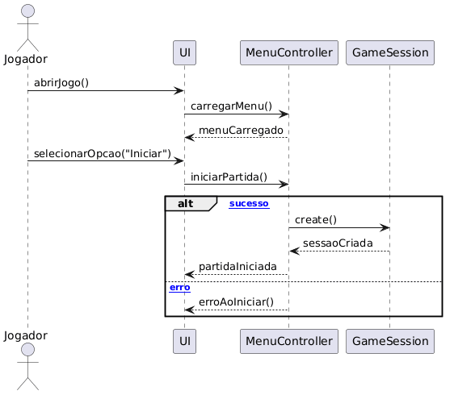
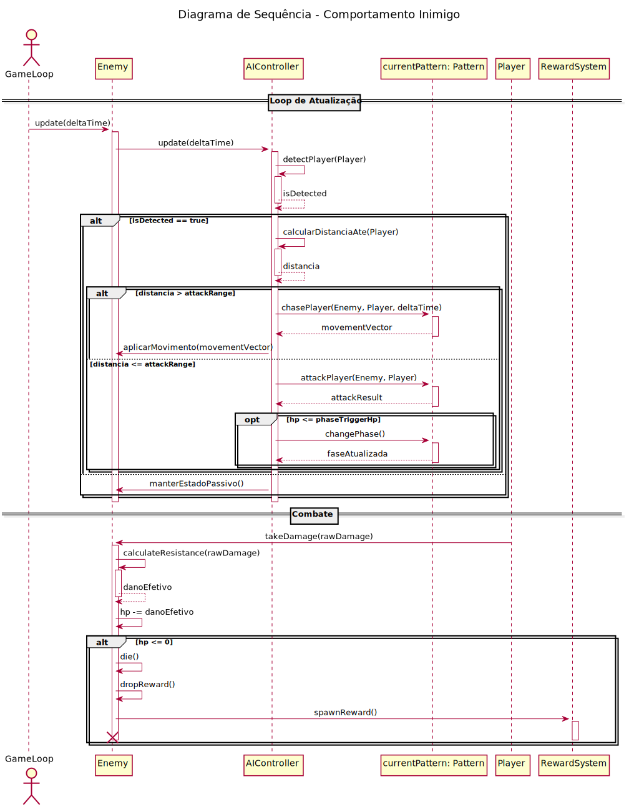
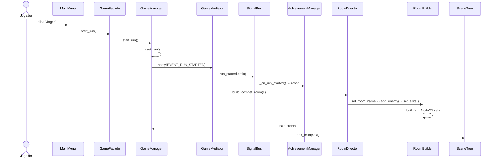
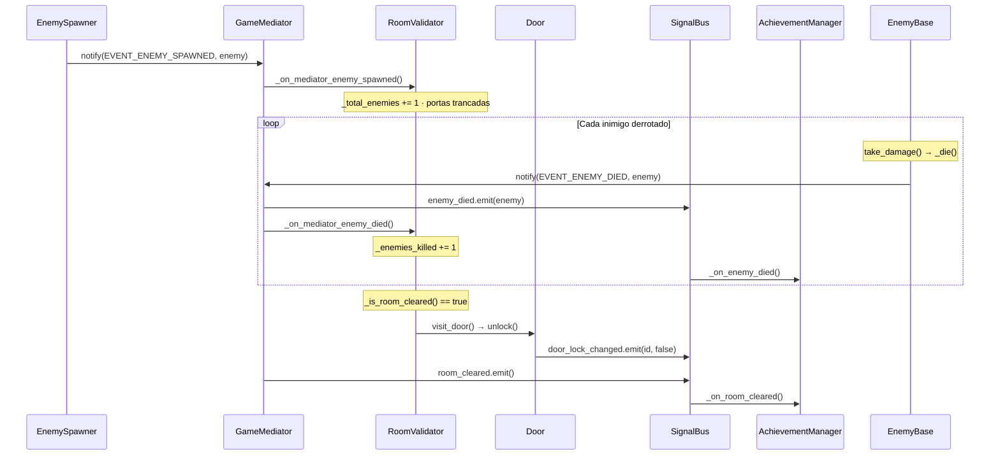
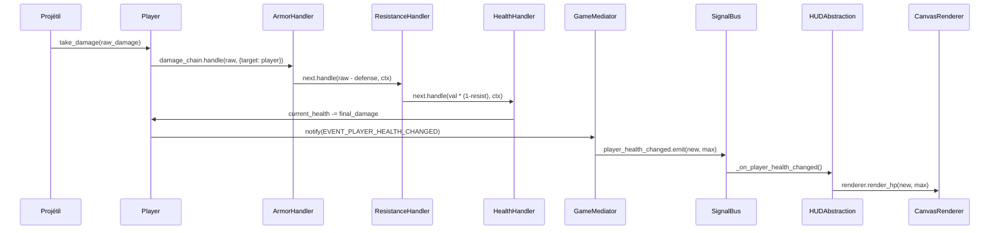
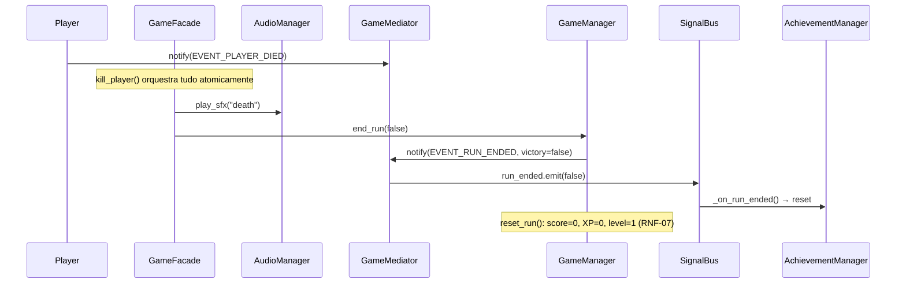
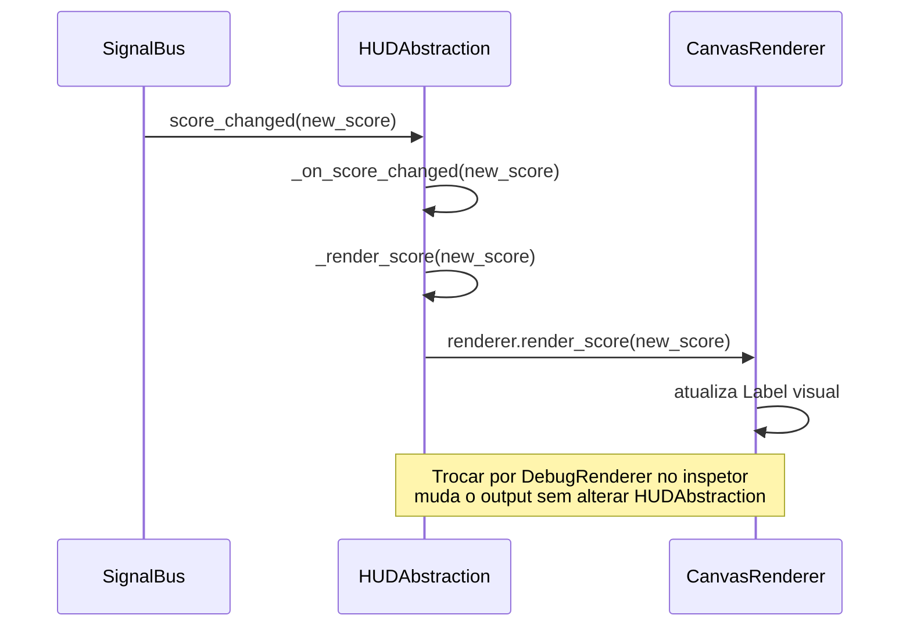

# 2.2.1. Diagramas de Sequência

## O que é um Diagrama de Sequência?

Um Diagrama de Classes é uma representação visual da UML utilizada na engenharia de software para mostrar a estrutura estática do sistema, incluindo suas classes, atributos, métodos e relacionamentos. Seu objetivo principal é representar, em alto nível, a arquitetura do sistema, destacando quais componentes são necessários e como eles se comunicam entre si.

## Justificativa

A utilização de Diagramas de Sequência é justificada pela necessidade de modelar e entender as interações temporais e a troca de mensagens entre os objetos e atores do sistema. Como o projeto aborda mecânicas e fluxos de eventos específicos (como ataques, abertura de inventário e navegação de menus), os diagramas de sequência permitem visualizar a ordem exata das operações, facilitando a identificação de possíveis erros lógicos e a compreensão do ciclo de vida das funcionalidades.

## Diagramas de Sequência Desenvolvidos

### Iniciar partida a partir do menu principal

*Desenvolvido por: [Breno Lucena](https://github.com/BrenoLUCO)*

#### Participantes
- Jogador (ator externo)
- UI
- MenuController
- GameSession

#### Fluxo Principal (Sucesso)
1. Jogador executa abrirJogo().
2. UI solicita carregarMenu() ao MenuController.
3. MenuController retorna menuCarregado.
4. Jogador seleciona selecionarOpcao("Iniciar").
5. UI solicita iniciarPartida() ao MenuController.
6. MenuController solicita create() para GameSession.
7. GameSession retorna sessaoCriada.
8. UI apresenta partidaIniciada ao Jogador.

#### Fluxo Alternativo (Erro)
1. Durante iniciarPartida(), ocorre falha na criação da sessão.
2. Sistema retorna erroAoIniciar().
3. UI informa falha ao Jogador.

---

### Sistema de Combate e Projéteis

*Desenvolvido por: [Kauã Richard](https://github.com/kauarichard)*

1. **Input de Ataque**: O Ator (Jogador) envia um comando para o objeto **Player**.
2. **Geração de Projétil**: O **Player** solicita à **Weapon** a criação de um novo projétil.
3. **Ciclo de Vida do Projétil**: 
   - O Projétil é instanciado.
   - Entra em um **loop** de movimentação e verificação de sobreposição (colisão).
4. **Aplicação de Dano**: Ao colidir com o **Enemy**, o Projétil aciona o método de sofrer dano.
5. **Feedback**: O Inimigo retorna a confirmação e o sistema envia um feedback visual/sonoro antes de destruir o projétil.

##### Lifelines (Linhas de Vida)
- **Jogador**: Ator que inicia a dinâmica.
- **Player**: Controlador do personagem.
- **Weapon**: Responsável pela lógica de disparo.
- **Projectile**: Entidade dinâmica que processa a colisão.
- **Enemy**: Alvo que recebe a aplicação do dano.
---

### Comportamento dos Inimigos em Combate

Arquivo fonte: [Sequencia_ComportamentoInimigo.puml](../Assets/UML/Sequencia_ComportamentoInimigo.puml)

*Desenvolvido por: [Mateus Vinicius Vieira](https://github.com/matix0)*

#### Descrição

Diagrama de sequência que modela a lógica de atualização contínua e as reações a ataques da Inteligência Artificial dos inimigos, ilustrando as tomadas de decisão baseadas na detecção do jogador, cálculo de distâncias e o ciclo de vida e morte durante o combate.

#### Participantes (Lifelines)
- **GameLoop**: Ator que envia o pulso de atualização constante (frame a frame).
- **Enemy**: A entidade/componente principal do inimigo instanciada no jogo.
- **AIController**: Controlador lógico responsável por gerenciar o "cérebro" e a tomada de decisões do inimigo.
- **currentPattern (Pattern)**: O padrão de comportamento/estratégia atual associado ao inimigo (define como persegue ou ataca).
- **Player**: O jogador (alvo das ações e emissor de dano).
- **RewardSystem**: Sistema gerenciador de espólios que distribui recompensas ao derrotar o inimigo.

#### Fluxo 1: Loop de Atualização
1. O **GameLoop** chama `update(deltaTime)` no **Enemy**, que repassa a chamada ao **AIController**.
2. O **AIController** aciona `detectPlayer()` internamente.
3. **Alt (Detectado == true)**: O controlador calcula a distância até o jogador.
   - **Alt (Distância > attackRange)**: O controlador delega ao **Pattern** a ação de perseguição (`chasePlayer`), recebe um vetor de movimento e o aplica ao inimigo.
   - **Alt (Distância <= attackRange)**: O controlador aciona o **Pattern** para atacar (`attackPlayer`). Adicionalmente, caso o HP do inimigo cruze um limiar configurado (`hp <= phaseTriggerHp`), o padrão de ataque pode evoluir/mudar de fase (`changePhase()`).
4. **Alt (Detectado == false)**: O controlador instrui o inimigo a `manterEstadoPassivo()`.

#### Fluxo 2: Resolução de Combate
1. O **Player** envia `takeDamage(rawDamage)` ao **Enemy**.
2. O inimigo calcula seu dano efetivo subtraindo eventuais resistências (`calculateResistance`) e reduz do seu HP.
3. **Alt (HP <= 0)**: O inimigo processa sua rotina de morte (`die()`), aciona o drop de itens delegando o spawn ao **RewardSystem** e é destruído da cena.

### Abrir Inventário, Descartar Item e Atualizar UI

*Desenvolvido por: [Vinícius Rufino](https://github.com/RufinoVfR)*

1. **Fase 1 — Abrir Inventário**: O jogador aciona a abertura do inventário. A InventoryUI solicita ao InventoryController o carregamento dos itens, que por sua vez consulta o InventoryService. A lista de itens retorna pela cadeia até ser exibida ao jogador

2. **Fase 2 — Descartar Item**: O jogador seleciona um item e solicita o descarte. O bloco `alt` modela dois fluxos alternativos:
   - **Confirma descarte**: O InventoryController remove o item via InventoryService e instrui a InventoryUI a atualizar a exibição com feedback visual
   - **Cancela descarte**: O InventoryController instrui a InventoryUI a exibir feedback de cancelamento

##### Participantes (Lifelines)
- **Jogador**: Ator externo que inicia as ações de abertura e descarte
- **InventoryUI**: Interface visual que responde a inputs e exibe o estado do inventário
- **InventoryController**: Lógica de controle que orquestra o fluxo completo
- **InventoryService**: Camada de acesso e persistência dos dados dos itens (SessionStorage)

##### Pré-condições
- Inventário com slots fixos disponíveis (US-51)
- Item previamente coletado presente no inventário (US-52)

## Justificativa

A utilização de Diagramas de Sequência é justificada pela necessidade de modelar e entender as interações temporais e a troca de mensagens entre os objetos e atores do sistema. Como o projeto aborda mecânicas e fluxos de eventos específicos (como ataques, abertura de inventário e navegação de menus), os diagramas de sequência permitem visualizar a ordem exata das operações, facilitando a identificação de possíveis erros lógicos e a compreensão do ciclo de vida das funcionalidades.

## Evidências de Arquitetura — Sequências validadas no DAS (Entrega 4)

Os diagramas de sequência abaixo foram elaborados no [Documento de Arquitetura de Software (DAS)](/ArquiteturaReutilizacao/4.1.DAS.md) da Entrega 4 e **validados** estrutural e semanticamente (sintaxe Mermaid 11 e coerência com a implementação real na branch `game`). Eles detalham o comportamento dinâmico dos sistemas e servem como evidência de rastreabilidade entre a modelagem desta entrega e a arquitetura consolidada na Entrega 4.

### Inicialização de Run — Facade + Builder/Director (DAS §6.2)

Do clique em "Jogar" até a sala montada: `GameFacade.start_run()` delega ao `GameManager`, que reseta o estado, notifica o início via Mediator/SignalBus e monta a primeira sala via `RoomDirector`/`RoomBuilder`.

### Loop de Combate e Liberação de Sala (DAS §6.3)

As portas trancam ao spawnar inimigos (US-57); a cada inimigo derrotado o `RoomValidator` contabiliza, e ao limpar a sala visita a porta (`unlock`), emitindo `door_lock_changed` e `room_cleared`.

### Cadeia de Dano ao Jogador — Chain of Responsibility + HUD (DAS §6.4)

O dano bruto passa pela cadeia `ArmorHandler → ResistanceHandler → HealthHandler`; ao alterar a vida, o HUD é atualizado via Bridge (`render_hp`).

### Morte do Jogador e Permadeath (DAS §6.5)

`kill_player()` orquestra atomicamente som, fim de run e reset total do estado da sessão (RNF-07).

### Atualização do HUD via Bridge (DAS §6.6)

`HUDAbstraction` define *o que* exibir e delega *como* renderizar ao `UIRenderer` concreto; trocar `CanvasRenderer` por `DebugRenderer` muda a saída sem alterar a abstração.

## Referências
- Materiais de apoio disponibilizados pela professora via Aprender3.
- https://www.uml-diagrams.org/sequence-diagrams.html

## Histórico de Versionamento

| Nome                                                     | Alteração                                                             | Versão | Data       | Revisor                                     | Data de Revisão | Revisão                                                                                                             |
| -------------------------------------------------------- | --------------------------------------------------------------------- | ------ | ---------- | ------------------------------------------- | --------------- | ------------------------------------------------------------------------------------------------------------------- |
| [Mateus Vieira](https://github.com/matix0/)              | Setup inicial do projeto                                              | v0.1   | 13/04/2026 |                                             |                 |                                                                                                                     |
| [Philipe Morais](https://github.com/PhMoraiis/)          | Adiciona Diagrama de Atividades para Consumiveis                      | v1.1   | 22/04/2026 | [Mateus Vieira](https://github.com/matix0/) | 22/04/2026      | Fluxo do uso de itens muito bem explicado, diagrama simples e bem estruturado                                       |
| [Mateus Vieira](https://github.com/matix0/)              | Adição do Diagrama de Sequência Comportamento dos Inimigos em Combate | v1.2   | 22/04/2026 |                                             |                 |                                                                                                                     |
| [Pietro Calegari Visentin](https://github.com/pietrocv)  | Adição do Diagrama de Estados do Sistema de Equipamentos              | v1.3   | 22/04/2026 | [Mateus Vieira](https://github.com/matix0/) | 22/04/2026      | Senti que faltou um detalhamento maior do diagrama, como as funções funcionam, uma explicação via texto seria boa   |
| [Lucas Freire](https://github.com/AguionStryke)          | Adição do Diagrama de Atividades Vida, Cura e Morte do Personagem     | v1.4   | 23/04/2026 | [Mateus Vieira](https://github.com/matix0/) | 22/04/2026      | Fluxo do sistema de vida muito bem representado, considerando condição também qual a condição para morte do jogador |
| [Vinícius Rufino](https://github.com/RufinoVfR)          | Adiciona Diagrama de Sequência para Inventário                        | v1.5   | 23/04/2026 | [Mateus Vieira](https://github.com/matix0/) | 23/04/2026      | Representa muito bem como o sistema de uso do inventário funciona considerando atualização e descarte dos itens     |
| [Kauã Richard](https://github.com/kauarichard)           | Adiciona Diagrama de Sequência para Combate                           | v1.6   | 23/04/2026 | [Mateus Vieira](https://github.com/matix0/) | 22/04/2026      | Fluxo bem detalhado do sistema de combate, exemplifica bem como o jogador irá combater os inimigos                  |
| [Felipe Santos Veríssimo](https://github.com/verissimoo) | Adição do Diagrama de Estados Pausar/Retomar (US-49, US-50)           | v1.7   | 24/04/2026 | [Mateus Vieira](https://github.com/matix0/) | 24/04/2026      | Diagrama bem estruturado, com os estados de jogo bem definidos e transições claras.                                 |
| [Breno Lucena](https://github.com/BrenoLUCO)             | Adição do diagrama de sequencia iniciar partida                       | v1.8   | 23/04/2026 | [Mateus Vieira](https://github.com/matix0/) | 24/04/2026      | Processo de início de partida muito bem ilustrado, interações do menu ao GameSession cobrem bem o cenário.          |
| [Felipe Santos Veríssimo](https://github.com/verissimoo) | Adição de 5 sequências validadas do DAS (Inicialização de Run, Loop de Combate, Cadeia de Dano, Morte/Permadeath e HUD via Bridge) como evidência de arquitetura | v1.9 | 22/06/2026 | | | |